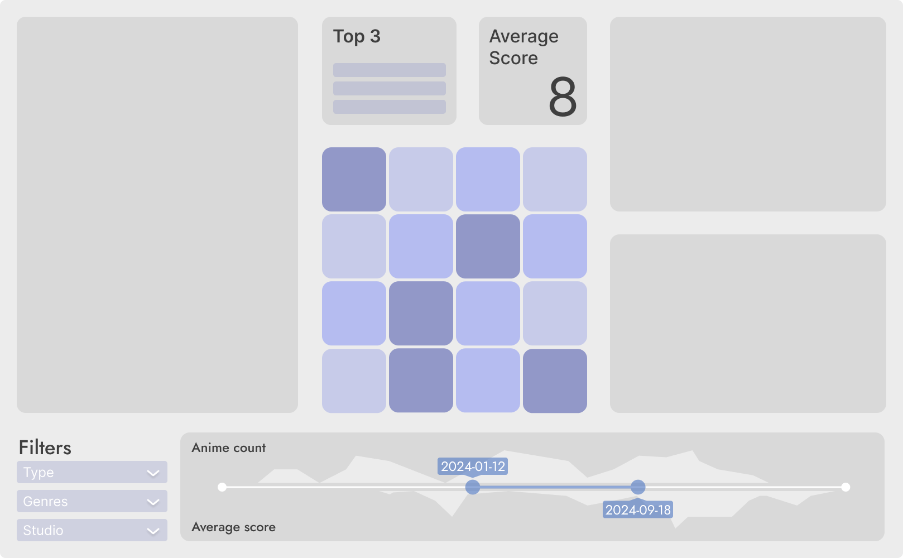

# Anime Popularity & Ratings Dashboard

## Table of Contents
- [Overview](#overview)
  - [Landing Page](#landing-page)
  - [Sketch of App Layout](#sketch-of-app-layout)
- [Project Setup](#project-setup)

## Overview <a name="overview"></a>
This project is designed to develop an interactive dashboard that analyzes key factors affecting anime **popularity and ratings**. The primary goal is to provide actionable insights for certain audiences such as **anime companies, studios, investors** and so on. Therefore, the dashboard would be helpful for maximizing profitability by identifying the most critical predictors influencing anime success.

### **Landing Page** <a name="landing-page"></a>
1. **Base Visualization Panel**
   - **Heat Map**
     - showing **the correlation between the various predictors with target variables**.
     - The heatmap will identify the key predictor to support advanced analysis.

2. **Supporting Visualization Panels**
   - **Summary Statistic**
     - Top 3 important predictors such as **genre, studio** of anime success.
     - **Average rating** of anime by those predictors as well.
   - **Time-Series Plot (with filtering slider)**
     - Identifies the **optimal time** of year for anime releases and its score based on historical trends.
   - **Bar Chart (exmaple - genre vs. rating)**
     - Explores the impact of significant predictor such as genre on ratings.
   - **Radar Chart**
     - Group by different **catogorical** predictors (e.g. genre, studio ...)
     - Identifies which predictors are more **important in terms of various metircs** such as number of people watching, average rating, number of episodes, etc.
   - **List of Filters**
     - Mose of plots in the page can be controlled by different `Types, Genres, and Studios`.
   - **Scatter plot (episode length vs. rating)**
     - Determines the relationship betweene these two, we can get **optimal** series length for the **better audience engagement and profitability**.

### Sketch of App Layout <a name="sketch-of-app-layout"></a>


## Project Setup

1. Create a Virtual Environment

```bash
python -m venv venv
```

2. Activate the Virtual Environment
```bash
source venv/bin/activate # on Mac
.\venv\Scripts\activate # on Windows
```

```
pip install -r requirements.txt
```

3. Run the app
```bash
cd src
python main.py
```

<div style="display: flex; flex-direction: column; align-items: center;">
  <h6>The dataset is collected from:</h6>
  <a href="https://www.kaggle.com/datasets/dbdmobile/myanimelist-dataset" target="_blank">
  
  </a>
</div>
