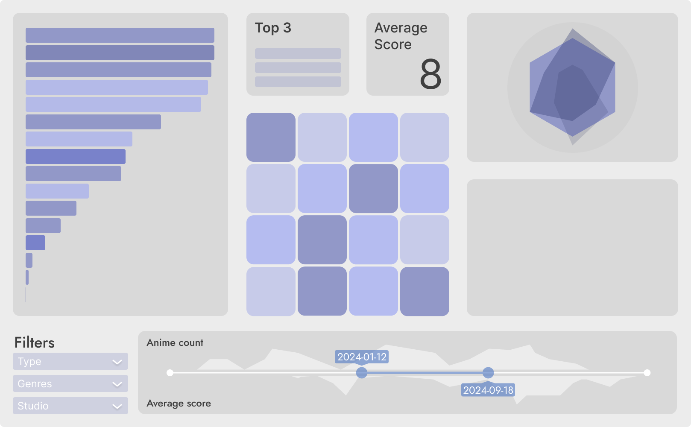

# Anime Popularity & Ratings Dashboard
[Project Setup](#project-setup)
## Overview
This project is designed to develop an interactive dashboard that analyzes key factors affecting anime **popularity and ratings**. The primary goal is to provide actionable insights for certain audiences such as **anime companies, studios, investors** and so on. Therefore, the dashboard would be helpful for maximizing profitability by identifying the most critical predictors influencing anime success.

### **Main Components**
1. **HeatMap (Main Plot)**
   - A heatmap showing **the correlation between the various predictors with target variables**.
   - This will be the primary insight to guide what predictors we should most liekly focus on.

2. **Supporting Visualization Panels**
   - **Summary Statistic**
     - Top 3 important predictors such as **genre, studio** of anime success.
     - **Average rating** of anime by those predictors as well.
   - **Time-Series Plot (with filtering slider)**
     - Identifies the **optimal time** of year for anime releases and its score based on historical trends.
   - **Bar Chart (exmaple - genre vs. rating)**
     - Explores the impact of significant predictor such as genre on ratings.
   - **Radar Chart**
     - Analyzes the effect of production decisions on anime success.
   - **List of Filters**
     - Evaluates how format (TV, Movie, OVA) and duration influence ratings.
   - **Last plot**
     - Determines whether longer or shorter series tend to perform better.

## Sketch of App Layout


## Project Setup
```
pip install -r requirements.txt
```


<div style="display: flex; flex-direction: column; align-items: center;">
  <h6>The dataset is collected from:</h6>
  <a href="https://www.kaggle.com/datasets/dbdmobile/myanimelist-dataset" target="_blank">
  
  </a>
</div>
