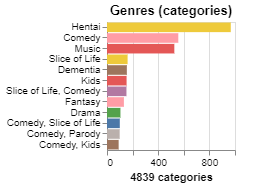
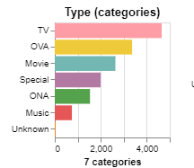
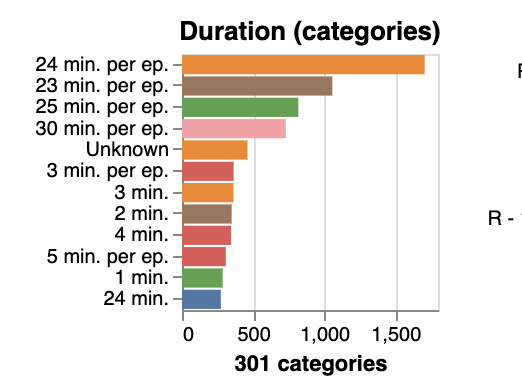
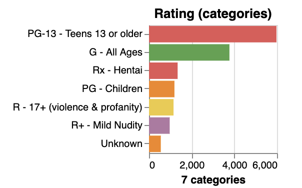

# Proposal

## 1. Motivation and purpose

Role: Data Science Consultancy Team

Target Audience: Anime Enthusiasts, Anime Industry Professionals

Anime is becoming increasingly popular due to a growing fan base and advancements in anime production technology. Fans and anime-related businesses or companies are aware of the attraction and the expanding market of the anime. Thus, as a data science consultancy team, we are interested in the factors that most significantly impact anime popularity and ratings and how anime industries and companies can use these insights to maximize profitability or attract more fans.

Moreover, the purpose of our project is to create a dashboard with several interactive visualizations to determine the factors that strongly correlate with audience satisfaction through the analysis of metrics such as scores, genre, type, timeline, and popularity of anime. Through the interactivity of the provided visualizations, users can examine the data, view relationships, and research patterns regarding the success of anime on a deeper level. For the specific target audience, the dashboard can help anime enthusiasts quickly find top-rated anime, as well as assist anime industry professionals in gaining a deeper understanding of the anime market and producing higher-rated anime.4

## 2. Description of Data

### Dataset Column Descriptions and Overview

This dataset is sourced from MyAnimeList (MAL) and contains structured information about various anime, including metadata, ratings, and engagement statistics. Below is a detailed description of each column:

### Column Descriptions

| Column Name   | type    | Description                                                                   | Distribution                                  |
| ------------- | ------- | ----------------------------------------------------------------------------- | --------------------------------------------- |
| anime_id      | int64   | Unique ID for each anime.                                                     |
| Name          | str     | The name of the anime in its original language.                               |
| Score         | float64 | The score or rating given to the anime.                                       |    |
| Genres        | str     | The genres of the anime, separated by commas.                                 |    |
| English name  | str     | The English name of the anime.                                                |
| Japanese name | str     | The Japanese name of the anime.                                               |
| Synopsis      | str     | A brief description or summary of the anime's plot.                           |
| Type          | str     | The type of the anime (e.g., TV series, movie, OVA, etc.).                    |      |
| Episodes      | int64   | The number of episodes in the anime.                                          |
| Aired         | str     | The dates when the anime was aired.                                           |
| Premiered     | str     | The season and year when the anime premiered.                                 |
| Producers     | str     | The production companies or producers of the anime.                           |
| Licensors     | str     | The licensors of the anime (e.g., streaming platforms).                       |
| Studios       | str     | The animation studios that worked on the anime.                               |
| Source        | str     | The source material of the anime (e.g., manga, light novel, original).        |    |
| Duration      | str     | The duration of each episode.                                                 |  |
| Rating        | str     | The age rating of the anime.                                                  |    |
| Ranked        | str     | The rank of the anime based on its score.                                     |
| Popularity    | int64   | The popularity rank of the anime.                                             |
| Members       | int64   | The number of members who have added the anime to their list on the platform. |
| Favorites     | int64   | The number of times the anime was marked as a favorite by users.              |
| Watching      | int64   | The number of users who are currently watching the anime.                     |
| Completed     | int64   | The number of users who have completed the anime.                             |
| On-Hold       | int64   | The number of users who have put the anime on hold.                           |
| Dropped       | int64   | The number of users who have dropped the anime.                               |

This dataset will serve as the foundation for our analysis, allowing us to identify the key factors that contribute to an anime's popularity and high ratings. By leveraging interactive visualizations, we aim to uncover meaningful patterns and trends that influence audience engagement and reception.

## 3. Research questions and usage scenarios

### Research Questions

The primary goal of this project is to identify the key factors that contribute to an anime's popularity and high ratings, so that anime industries can use these insights for further production. To achieve this, we aim to answer the following research questions:
1. What are the most influential factors affecting an anime’s popularity?
2. How do popularity and high ratings relate to each other?
3. What are the key drivers behind high-rated anime?

### Usage Scenarios

Steven works as a content strategist for a major anime streaming platform. His goal is to understand the key elements that make an anime successful in order to help his company optimize its production strategy and promotional efforts. He wants to analyze existing anime data to determine what makes an anime popular and highly rated, allowing him to make data-driven decisions on which genres to acquire and promote. When Steven logs into our “Anime Insights Dashboard”, he is presented with the overview of anime statistics, such as number of total anime, their corresponding average scores across the timeline, and the summary of the scores of different genres’ anime. He can filter out the target genres, types and studios to look into further visualization and analysis. By referring to these visualizations, he can explore the relationship between animes’ rating and popularity to identify hidden patterns. Also, he can analyze the trends in anime production over time, and compare different genres to determine the ones receiving high ratings over a selected period. Using these analyses, he can recommend his company to focus on acquiring specific types of anime that align with both critical acclaim and audience engagement.
