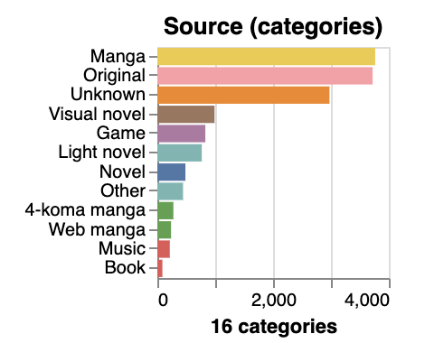

# Proposal

## 1. Motivation and purpose

## 2. Description of Data

### Dataset Column Descriptions and Overview

This dataset is sourced from MyAnimeList (MAL) and contains structured information about various anime, including metadata, ratings, and engagement statistics. Below is a detailed description of each column:

### Column Descriptions

| Column Name   | type    | Description                                                                   | Distribution |
| ------------- | ------- | ----------------------------------------------------------------------------- | ------------ |
| anime_id      | int64   | Unique ID for each anime.                                                     |
| Name          | str     | The name of the anime in its original language.                               |
| Score         | float64 | The score or rating given to the anime.                                       | 
| Genres        | str     | The genres of the anime, separated by commas.                                 |
| English name  | str     | The English name of the anime.                                                |
| Japanese name | str     | The Japanese name of the anime.                                               |
| Synopsis      | str     | A brief description or summary of the anime's plot.                           |
| Type          | str     | The type of the anime (e.g., TV series, movie, OVA, etc.).                    |
| Episodes      | int64   | The number of episodes in the anime.                                          |
| Aired         | str     | The dates when the anime was aired.                                           |
| Premiered     | str     | The season and year when the anime premiered.                                 |
| Producers     | str     | The production companies or producers of the anime.                           |
| Licensors     | str     | The licensors of the anime (e.g., streaming platforms).                       |
| Studios       | str     | The animation studios that worked on the anime.                               |
| Source        | str     | The source material of the anime (e.g., manga, light novel, original).        |
| Duration      | str     | The duration of each episode.                                                 |
| Rating        | str     | The age rating of the anime.                                                  |
| Ranked        | str     | The rank of the anime based on its score.                                     |
| Popularity    | int64   | The popularity rank of the anime.                                             |
| Members       | int64   | The number of members who have added the anime to their list on the platform. |
| Favorites     | int64   | The number of times the anime was marked as a favorite by users.              |
| Watching      | int64   | The number of users who are currently watching the anime.                     |
| Completed     | int64   | The number of users who have completed the anime.                             |
| On-Hold       | int64   | The number of users who have put the anime on hold.                           |
| Dropped       | int64   | The number of users who have dropped the anime.                               |

## 3. Research questions and usage scenarios
